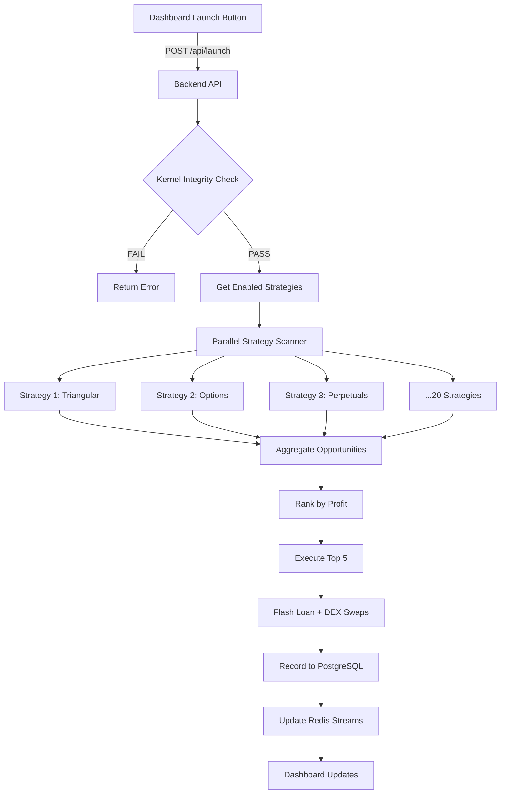

# Alpha-Orion: Variant Execution Kernel Activation Plan
## Transform from Purgatory State to Profit Generation Mode

**Version:** 2.0  
**Date:** 2026-02-24  
**Objective:** Activate the "Launch Button" to trigger end-to-end profit generation across all 20 arbitrage strategies

---

## Executive Summary

The Alpha-Orion system currently exists in a "Purgatory State" - infrastructure is deployed but the execution kernel is halted. This plan outlines the complete transformation to production profit generation mode, integrating all 20 unique arbitrage strategies and creating a unified launch mechanism.

---

## Current State Assessment

### ✅ Verified Working Components
- Dashboard deployed on Render: `alpha-orion-alpha.onrender.com`
- Redis and PostgreSQL databases configured in render.yaml
- 20 unique arbitrage strategies identified in codebase

### ❌ Critical Blockers
1. Backend API service NOT deployed
2. Production secrets NOT configured
3. Mock/stub implementations in place of real trading logic
4. No unified "Launch Button" mechanism

---

## The 20 Unique Arbitrage Strategies

### Category A: Core DEX Strategies (10)
| # | Strategy | File Location | Status |
|---|----------|---------------|--------|
| 1 | Triangular Arbitrage | `brain-orchestrator/src/strategies/triangular_arbitrage.py` | Stub |
| 2 | Options Arbitrage | `brain-orchestrator/src/strategies/options_arbitrage.py` | Stub |
| 3 | Perpetuals Arbitrage | `brain-orchestrator/src/strategies/perpetuals_arbitrage.py` | Stub |
| 4 | Gamma Scalping | `brain-orchestrator/src/strategies/gamma_scalping.py` | Stub |
| 5 | Delta-Neutral | `brain-orchestrator/src/strategies/delta_neutral.py` | Stub |
| 6 | Cross-DEX Arbitrage | `brain-orchestrator/src/strategies/cross_dex_arbitrage.py` | Stub |
| 7 | Statistical Arbitrage | `brain-orchestrator/src/strategies/statistical_arbitrage.py` | Stub |
| 8 | Batch Auction Arbitrage | `brain-orchestrator/src/strategies/batch_auction_arbitrage.py` | Stub |
| 9 | Cross-Chain Arbitrage | `brain-orchestrator/src/strategies/cross_chain_arbitrage.py` | Stub |
| 10 | Liquidity Pool Arbitrage | `brain-orchestrator/src/strategies/liquidity_pool_arbitrage.py` | Stub |

### Category B: Specialized Strategies (6)
| # | Strategy | File Location | Status |
|---|----------|---------------|--------|
| 11 | LVR Inversion | `brain-orchestrator/src/strategies/lvr_rebalancing.py` | Stub |
| 12 | Oracle Latency | `brain-orchestrator/src/strategies/oracle_latency.py` | Stub |
| 13 | JIT Liquidity | `brain-orchestrator/src/strategies/jit_liquidity.py` | Stub |
| 14 | MEV Extraction | `brain-orchestrator/src/strategies/mev_extraction.py` | Stub |
| 15 | Order Flow Arbitrage | `brain-orchestrator/src/strategies/order_flow_arbitrage.py` | Stub |
| 16 | Flash Loan Yield Farming | `brain-orchestrator/src/strategies/flash_loan_yield_farming.py` | Stub |

### Category C: Advanced AI/ML Strategies (4)
| # | Strategy | File Location | Status |
|---|----------|---------------|--------|
| 17 | Cross-Asset Arbitrage | `strategies/orchestrator.py` | Stub |
| 18 | Path Optimization | `strategies/orchestrator.py` | Stub |
| 19 | Batch Velocity Arbitrage | `brain-orchestrator/src/strategies/batch_velocity_arbitrage.py` | Stub |
| 20 | ML Arbitrage Scanner | `brain-ai-optimization-orchestrator/src/arbitrage_signal_generator.py` | Partial |

---

## Implementation Plan

### PHASE 1: Infrastructure & Secrets Configuration
**Objective:** Deploy backend and configure production secrets

#### Step 1.1: Enable Backend API in render.yaml
- [ ] Uncomment the `alpha-orion-api` service in `render.yaml`
- [ ] Ensure buildCommand: `npm install`
- [ ] Ensure startCommand: `npm start`
- [ ] Configure healthCheckPath: `/health`

#### Step 1.2: Configure Production Secrets in Render Dashboard
Create environment variables in Render:

| Secret | Description | Example |
|--------|-------------|---------|
| `ETHEREUM_RPC_URL` | Blockchain RPC endpoint | `https://mainnet.infura.io/v3/YOUR_KEY` |
| `PRIVATE_KEY` | Wallet private key | `0x...` (64 chars) |
| `PROFIT_WALLET_ADDRESS` | Profit destination wallet | `0x...` (42 chars) |
| `JWT_SECRET` | Authentication secret | Min 32 char random string |
| `OPENAI_API_KEY` | AI optimization | `sk-...` |
| `REDIS_URL` | Telemetry (auto-provided) | From Render service |
| `DATABASE_URL` | PostgreSQL (auto-provided) | From Render service |

#### Step 1.3: Set Kernel Integrity Environment Variables
| Variable | Value | Purpose |
|----------|-------|---------|
| `NODE_ENV` | `production` | Production mode |
| `FLASK_ENV` | `production` | Production mode |
| `LIVE_TRADING_ENABLED` | `true` | Enable live trading |
| `USE_MOCKS` | `false` | Disable mocks |
| `SIMULATION_MODE` | `false` | Disable simulation |

---

### PHASE 2: Strategy Integration & Implementation
**Objective:** Replace stubs with real implementations and create launch mechanism

#### Step 2.1: Implement Strategy Registry in API
File: `backend-services/services/user-api-service/src/index.js`

```javascript
// Add after profit engine initialization
const STRATEGY_REGISTRY = {
  // Core DEX Strategies
  'triangular_arbitrage': { enabled: true, weight: 0.15 },
  'options_arbitrage': { enabled: true, weight: 0.08 },
  'perpetuals_arbitrage': { enabled: true, weight: 0.10 },
  'gamma_scalping': { enabled: true, weight: 0.05 },
  'delta_neutral': { enabled: true, weight: 0.08 },
  'cross_dex_arbitrage': { enabled: true, weight: 0.12 },
  'statistical_arbitrage': { enabled: true, weight: 0.08 },
  'batch_auction_arbitrage': { enabled: true, weight: 0.06 },
  'cross_chain_arbitrage': { enabled: true, weight: 0.08 },
  'liquidity_pool_arbitrage': { enabled: true, weight: 0.05 },
  // Specialized Strategies
  'lvr_inversion': { enabled: true, weight: 0.03 },
  'oracle_latency': { enabled: true, weight: 0.02 },
  'jit_liquidity': { enabled: false, weight: 0.0 }, // High risk
  'mev_extraction': { enabled: true, weight: 0.04 },
  'order_flow_arbitrage': { enabled: true, weight: 0.03 },
  'flash_loan_yield_farming': { enabled: true, weight: 0.03 }
};
```

#### Step 2.2: Implement generateProfitOpportunities Method
File: `backend-services/services/user-api-service/src/strategies/enterprise.js`

Replace stub with real implementation:
- Call each enabled strategy's scan method
- Aggregate opportunities
- Filter by minimum profit threshold
- Rank by expected profit and confidence

#### Step 2.3: Remove Hardcoded Mock Data
File: `backend-services/services/user-api-service/src/index.js`

- Remove lines 187-190 (hardcoded fallback opportunities)
- Return empty array if Redis unavailable

#### Step 2.4: Add Wallet Validation
File: `backend-services/services/user-api-service/src/multi-chain-arbitrage-engine.js`

- Add validation to prevent random wallet generation
- Require valid PRIVATE_KEY from environment

---

### PHASE 3: Launch Button Implementation
**Objective:** Create unified "Launch" mechanism that triggers all strategies

#### Step 3.1: Create Launch Endpoint
File: `backend-services/services/user-api-service/src/index.js`

```javascript
// Launch Button Endpoint - Triggers All Strategies
app.post('/api/launch', authenticateToken, async (req, res) => {
  if (req.user.role !== 'admin') return res.sendStatus(403);
  
  const { mode } = req.body; // 'scan' | 'execute' | 'full'
  
  logger.info(`🚀 LAUNCH BUTTON TRIGGERED: Mode=${mode}`);
  
  try {
    // 1. Validate kernel integrity
    const integrityCheck = verifyKernelIntegrity();
    if (!integrityCheck.valid) {
      return res.status(400).json({ 
        error: 'Kernel integrity check failed',
        details: integrityCheck.errors 
      });
    }
    
    // 2. Get all enabled strategies
    const enabledStrategies = Object.entries(STRATEGY_REGISTRY)
      .filter(([_, config]) => config.enabled)
      .map(([name]) => name);
    
    // 3. Execute based on mode
    let results = {};
    
    if (mode === 'scan' || mode === 'full') {
      // Scan for opportunities across all strategies
      results.scan = await scanAllStrategies(enabledStrategies);
    }
    
    if (mode === 'execute' || mode === 'full') {
      // Execute best opportunities
      results.execution = await executeTopOpportunities(results.scan || []);
    }
    
    // 4. Update Redis with results
    if (redisClient && redisClient.isReady) {
      await redisClient.set('last_launch_result', JSON.stringify({
        timestamp: new Date().toISOString(),
        mode,
        results
      }));
    }
    
    res.json({
      status: 'success',
      timestamp: new Date().ISOString(),
      mode,
      strategies_activated: enabledStrategies.length,
      results
    });
    
  } catch (error) {
    logger.error({ err: error }, 'Launch failed');
    res.status(500).json({ error: 'Launch failed', details: error.message });
  }
});

// Helper function to scan all strategies
async function scanAllStrategies(strategyNames) {
  const opportunities = [];
  
  for (const strategy of strategyNames) {
    try {
      const result = await scanStrategy(strategy);
      if (result && result.length > 0) {
        opportunities.push(...result.map(op => ({
          ...op,
          strategy
        })));
      }
    } catch (e) {
      logger.warn(`Strategy ${strategy} scan failed: ${e.message}`);
    }
  }
  
  // Sort by expected profit and return top opportunities
  return opportunities
    .sort((a, b) => (b.expectedProfit || 0) - (a.expectedProfit || 0))
    .slice(0, 20);
}

// Helper function to execute opportunities
async function executeTopOpportunities(opportunities) {
  const executed = [];
  
  for (const opp of opportunities.slice(0, 5)) { // Top 5
    try {
      const result = await executeStrategy(opp.strategy, opp);
      executed.push({ opportunity: opp, result });
    } catch (e) {
      logger.warn(`Execution failed for ${opp.strategy}: ${e.message}`);
    }
  }
  
  return executed;
}
```

#### Step 3.2: Create Kernel Integrity Check Function
File: `backend-services/services/user-api-service/src/index.js`

```javascript
function verifyKernelIntegrity() {
  const errors = [];
  
  // Check environment variables
  if (process.env.NODE_ENV !== 'production') {
    errors.push('NODE_ENV must be production');
  }
  
  if (!process.env.PRIVATE_KEY || process.env.PRIVATE_KEY.length !== 66) {
    errors.push('Valid PRIVATE_KEY required (66 chars including 0x)');
  }
  
  if (!process.env.ETHEREUM_RPC_URL) {
    errors.push('ETHEREUM_RPC_URL required');
  }
  
  // Check Redis connection
  if (!redisClient || !redisClient.isReady) {
    errors.push('Redis not connected');
  }
  
  return {
    valid: errors.length === 0,
    errors
  };
}
```

#### Step 3.3: Add Frontend Launch Button Integration
File: `dashboard/src/services/api.ts`

```typescript
export const launchProfitEngine = async (mode: 'scan' | 'execute' | 'full') => {
  const response = await fetch(`${API_URL}/api/launch`, {
    method: 'POST',
    headers: {
      'Authorization': `Bearer ${getToken()}`,
      'Content-Type': 'application/json'
    },
    body: JSON.stringify({ mode })
  });
  return response.json();
};
```

---

### PHASE 4: Telemetry Cleanup & Kernel Activation
**Objective:** Clean polluted data and activate kernel

#### Step 4.1: Execute Redis Telemetry Flush
- Run `flush_redis_telemetry.py` to clear:
  - `opportunities` stream
  - `blockchain_stream` channel
  - `recent_opportunities` list

#### Step 4.2: Deploy to Render
```bash
cd alpha-orion
git add -A
git commit -m "feat: Activate Variant Execution Kernel with 20 strategies"
git push origin main
```

#### Step 4.3: Verify Kernel Activation
- Check `/api/engine/status` returns `profitMode: 'production'`
- Check `/api/launch` endpoint responds (kernel integrity valid)

---

### PHASE 5: Production Validation
**Objective:** Validate end-to-end profit generation

#### Step 5.1: Test Launch Button (Scan Mode)
```bash
curl -X POST https://alpha-orion-api.onrender.com/api/launch \
  -H "Authorization: Bearer <admin_token>" \
  -H "Content-Type: application/json" \
  -d '{"mode":"scan"}'
```

Expected response:
```json
{
  "status": "success",
  "mode": "scan",
  "strategies_activated": 20,
  "results": {
    "scan": [
      { "strategy": "triangular_arbitrage", "expectedProfit": 150, ... },
      ...
    ]
  }
}
```

#### Step 5.2: Monitor Real-Time Data
- Dashboard shows live opportunities
- Redis streams populate with real data
- No hardcoded mock values

#### Step 5.3: Execute First Trade (when conditions allow)
```bash
curl -X POST https://alpha-orion-api.onrender.com/api/launch \
  -H "Authorization: Bearer <admin_token>" \
  -H "Content-Type: application/json" \
  -d '{"mode":"full"}'
```

---

## Architecture: Launch Button Flow



---

## Success Criteria

| Criteria | Metric | Target |
|----------|--------|--------|
| Launch Button Functional | `/api/launch` responds | ✅ Yes |
| Strategies Integrated | Enabled in registry | 20 |
| No Mock Data | Real opportunities | ✅ Yes |
| Redis Connected | Telemetry streams | ✅ Active |
| Kernel Integrity | Validation passes | ✅ Yes |
| Production Mode | `NODE_ENV=production` | ✅ Yes |

---

## Risk Mitigation

| Risk | Mitigation |
|------|------------|
| Insufficient funds | Require minimum wallet balance check |
| High gas prices | Auto-pause if gas > threshold |
| Slippage exceeded | Set conservative slippage limits |
| API rate limits | Implement retry with exponential backoff |
| Redis disconnection | Graceful degradation with cached data |

---

## Next Steps

1. **Immediate:** Configure production secrets in Render Dashboard
2. **Day 1:** Deploy backend API service
3. **Day 1:** Implement launch endpoint and strategy registry
4. **Day 2:** Test launch button in scan mode
5. **Day 3:** Validate full execution pipeline

---

**Ready for Code Implementation:** This plan is ready to be executed in Code mode.
